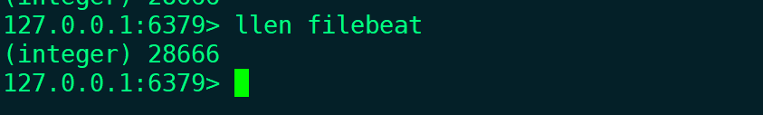

https://www.elastic.co/guide/en/elasticsearch/reference/current/rpm.html

导入Elasticsearch GPG密钥

```
rpm --import https://artifacts.elastic.co/GPG-KEY-elasticsearch
```

添加yum源

```
vim /etc/zypp/repos.d/elk.repo
[elasticsearch]
name=Elasticsearch repository for 7.x packages
baseurl=https://artifacts.elastic.co/packages/7.x/yum
gpgcheck=1
gpgkey=https://artifacts.elastic.co/GPG-KEY-elasticsearch
enabled=0
autorefresh=1
type=rpm-md
```

安装elasticsearch,logstash

```
 kibanayum install -y elasticsearch logstash kibana
```

#### elasticsearch

```
[root@glusterfs01 ~]# cat /etc/elasticsearch/elasticsearch.yml 
cluster.name: elk-cluster
node.name: node-1
path.data: /var/lib/elasticsearch
path.logs: /var/log/elasticsearch
network.host: 192.168.254.131
http.port: 9200
discovery.seed_hosts: ["192.168.254.131", "192.168.254.132"]
cluster.initial_master_nodes: ["node-1"]
http.cors.enabled: true  
http.cors.allow-origin: "*"
```

```
[root@glusterfs02 ~]# cat /etc/elasticsearch/elasticsearch.yml 
cluster.name: elk-cluster
node.name: node-2
path.data: /var/lib/elasticsearch
path.logs: /var/log/elasticsearch
network.host: 192.168.254.132
http.port: 9200
discovery.seed_hosts: ["192.168.254.131", "192.168.254.132"]
http.cors.enabled: true  
http.cors.allow-origin: "*"
```

查看节点

```
[root@glusterfs01 ~]#systemctl restart elasticsearch
[root@glusterfs01 ~]# curl -X GET "192.168.254.131:9200/_cat/nodes?v"
ip              heap.percent ram.percent cpu load_1m load_5m load_15m node.role   master name
192.168.254.131           16          96   1    0.09    0.10     0.07 cdfhilmrstw *      node-1
192.168.254.132           44          97   1    0.48    0.24     0.13 cdfhilmrstw -      node-2
[root@glusterfs01 ~]#
```

安装elasticsearch-head

```
wget https://npm.taobao.org/mirrors/node/latest-v4.x/node-v4.4.7-linux-x64.tar.gz
tar -zxvf node-v4.4.7-linux-x64.tar.gz
mv node-v4.4.7-linux-x64 /usr/local/node-v4.4

git clone https://github.com/mobz/elasticsearch-head
cd elasticsearch-head
npm install

elasticsearch.yml添加2个配置
vim /etc/elasticsearch/elasticsearch.yml
http.cors.enabled: true  
http.cors.allow-origin: "*" 

启动
npm run start
```

浏览器访问http://localhost:9100


添加单个文档，如果索引不存在，会使用内置的索引模板

```
#curl -X POST "192.168.254.131:9200/logs-my_app-default/_doc?pretty" -H 'Content-Type: application/json' -d'
{
  "@timestamp": "2099-05-06T16:21:15.000Z",
  "event": {
    "original": "192.0.2.42 - - [06/May/2099:16:21:15 +0000] \"GET /images/bg.jpg HTTP/1.0\" 200 24736"
  }
}
'
{
  "_index" : ".ds-logs-my_app-default-2021.06.15-000001",
  "_type" : "_doc",
  "_id" : "gFDhD3oBuWLWKd8MZKul",
  "_version" : 1,
  "result" : "created",
  "_shards" : {
    "total" : 2,
    "successful" : 1,
    "failed" : 0
  },
  "_seq_no" : 0,
  "_primary_term" : 1
}
```

添加多个文档

```
#curl -X PUT "192.168.254.131:9200/logs-my_app-default/_bulk?pretty" -H 'Content-Type: application/json' -d'
{ "create": { } }
{ "@timestamp": "2099-05-07T16:24:32.000Z", "event": { "original": "192.0.2.242 - - [07/May/2020:16:24:32 -0500] \"GET /images/hm_nbg.jpg HTTP/1.0\" 304 0" } }
{ "create": { } }
{ "@timestamp": "2099-05-08T16:25:42.000Z", "event": { "original": "192.0.2.255 - - [08/May/2099:16:25:42 +0000] \"GET /favicon.ico HTTP/1.0\" 200 3638" } }
'
```

返回结果

```
{
  "took" : 38,
  "errors" : false,
  "items" : [
    {
      "create" : {
        "_index" : ".ds-logs-my_app-default-2021.06.15-000001",
        "_type" : "_doc",
        "_id" : "h1DlD3oBuWLWKd8MFqtX",
        "_version" : 1,
        "result" : "created",
        "_shards" : {
          "total" : 2,
          "successful" : 2,
          "failed" : 0
        },
        "_seq_no" : 1,
        "_primary_term" : 1,
        "status" : 201
      }
    },
    {
      "create" : {
        "_index" : ".ds-logs-my_app-default-2021.06.15-000001",
        "_type" : "_doc",
        "_id" : "iFDlD3oBuWLWKd8MFqtX",
        "_version" : 1,
        "result" : "created",
        "_shards" : {
          "total" : 2,
          "successful" : 2,
          "failed" : 0
        },
        "_seq_no" : 2,
        "_primary_term" : 1,
        "status" : 201
      }
    }
  ]
}
```

以下搜索匹配所有日志条目`logs-my_app-default`并按`@timestamp`降序对它们进行排序

```
#curl -X GET "192.168.254.131:9200/logs-my_app-default/_search?pretty" -H 'Content-Type: application/json' -d'
{
  "query": {
    "match_all": { }
  },
  "sort": [
    {
      "@timestamp": "desc"
    }
  ]
}
'

```

```
返回结果
{
  "took" : 261,
  "timed_out" : false,
  "_shards" : {
    "total" : 1,
    "successful" : 1,
    "skipped" : 0,
    "failed" : 0
  },
  "hits" : {
    "total" : {
      "value" : 3,
      "relation" : "eq"
    },
    "max_score" : null,
    "hits" : [
      {
        "_index" : ".ds-logs-my_app-default-2021.06.15-000001",
        "_type" : "_doc",
        "_id" : "iFDlD3oBuWLWKd8MFqtX",
        "_score" : null,
        "_source" : {
          "@timestamp" : "2099-05-08T16:25:42.000Z",
          "event" : {
            "original" : "192.0.2.255 - - [08/May/2099:16:25:42 +0000] \"GET /favicon.ico HTTP/1.0\" 200 3638"
          }
        },
        "sort" : [
          4081940742000
        ]
      },
      {
        "_index" : ".ds-logs-my_app-default-2021.06.15-000001",
        "_type" : "_doc",
        "_id" : "h1DlD3oBuWLWKd8MFqtX",
        "_score" : null,
        "_source" : {
          "@timestamp" : "2099-05-07T16:24:32.000Z",
          "event" : {
            "original" : "192.0.2.242 - - [07/May/2020:16:24:32 -0500] \"GET /images/hm_nbg.jpg HTTP/1.0\" 304 0"
          }
        },
        "sort" : [
          4081854272000
        ]
      },
      {
        "_index" : ".ds-logs-my_app-default-2021.06.15-000001",
        "_type" : "_doc",
        "_id" : "gFDhD3oBuWLWKd8MZKul",
        "_score" : null,
        "_source" : {
          "@timestamp" : "2099-05-06T16:21:15.000Z",
          "event" : {
            "original" : "192.0.2.42 - - [06/May/2099:16:21:15 +0000] \"GET /images/bg.jpg HTTP/1.0\" 200 24736"
          }
        },
        "sort" : [
          4081767675000
        ]
      }
    ]
  }
}

```

获取特定字段，`_source`对于大型文档，解析整个文件很笨拙。要将其从响应中排除，可以将`_source`参数设置为`false`。相反，使用`fields` 参数来检索您想要的字段。

```
curl -X GET "192.168.254.131:9200/logs-my_app-default/_search?pretty" -H 'Content-Type: application/json' -d'
{
  "query": {
    "match_all": { }
  },
  "fields": [
    "@timestamp"
  ],
  "_source": false,
  "sort": [
    {
      "@timestamp": "desc"
    }
  ]
}
'
```

返回结果

```
{
  "took" : 372,
  "timed_out" : false,
  "_shards" : {
    "total" : 1,
    "successful" : 1,
    "skipped" : 0,
    "failed" : 0
  },
  "hits" : {
    "total" : {
      "value" : 3,
      "relation" : "eq"
    },
    "max_score" : null,
    "hits" : [
      {
        "_index" : ".ds-logs-my_app-default-2021.06.15-000001",
        "_type" : "_doc",
        "_id" : "iFDlD3oBuWLWKd8MFqtX",
        "_score" : null,
        "fields" : {
          "@timestamp" : [
            "2099-05-08T16:25:42.000Z"
          ]
        },
        "sort" : [
          4081940742000
        ]
      },
      {
        "_index" : ".ds-logs-my_app-default-2021.06.15-000001",
        "_type" : "_doc",
        "_id" : "h1DlD3oBuWLWKd8MFqtX",
        "_score" : null,
        "fields" : {
          "@timestamp" : [
            "2099-05-07T16:24:32.000Z"
          ]
        },
        "sort" : [
          4081854272000
        ]
      },
      {
        "_index" : ".ds-logs-my_app-default-2021.06.15-000001",
        "_type" : "_doc",
        "_id" : "gFDhD3oBuWLWKd8MZKul",
        "_score" : null,
        "fields" : {
          "@timestamp" : [
            "2099-05-06T16:21:15.000Z"
          ]
        },
        "sort" : [
          4081767675000
        ]
      }
    ]
  }
}

```

搜索日期范围，根据"@timestamp"降序排序

```
curl -X GET "192.168.254.131:9200/logs-my_app-default/_search?pretty" -H 'Content-Type: application/json' -d'
{
  "query": {
    "range": {
      "@timestamp": {
        "gte": "2099-05-05",
        "lt": "2099-05-08"
      }
    }
  },
  "fields": [
    "@timestamp"
  ],
  "_source": false,
  "sort": [
    {
      "@timestamp": "desc"
    }
  ]
}
'
```

返回结果

```
{
  "took" : 99,
  "timed_out" : false,
  "_shards" : {
    "total" : 1,
    "successful" : 1,
    "skipped" : 0,
    "failed" : 0
  },
  "hits" : {
    "total" : {
      "value" : 2,
      "relation" : "eq"
    },
    "max_score" : null,
    "hits" : [
      {
        "_index" : ".ds-logs-my_app-default-2021.06.15-000001",
        "_type" : "_doc",
        "_id" : "h1DlD3oBuWLWKd8MFqtX",
        "_score" : null,
        "fields" : {
          "@timestamp" : [
            "2099-05-07T16:24:32.000Z"
          ]
        },
        "sort" : [
          4081854272000
        ]
      },
      {
        "_index" : ".ds-logs-my_app-default-2021.06.15-000001",
        "_type" : "_doc",
        "_id" : "gFDhD3oBuWLWKd8MZKul",
        "_score" : null,
        "fields" : {
          "@timestamp" : [
            "2099-05-06T16:21:15.000Z"
          ]
        },
        "sort" : [
          4081767675000
        ]
      }
    ]
  }
}
```

您可以使用日期数学来定义相对时间范围。以下查询搜索过去一天的数据

```
curl -X GET "192.168.254.131:9200/logs-my_app-default/_search?pretty" -H 'Content-Type: application/json' -d'
{
  "query": {
    "range": {
      "@timestamp": {
        "gte": "now-1d/d",
        "lt": "now/d"
      }
    }
  },
  "fields": [
    "@timestamp"
  ],
  "_source": false,
  "sort": [
    {
      "@timestamp": "desc"
    }
  ]
}
'
```

删除索引

```
DELETE _data_stream/logs-my_app-default
```

#### logstash

##### stdin

```
[root@glusterfs03 ~]# cat /etc/logstash/conf.d/test.conf 
input {
  stdin {

  }
}
filter {

}
output {
  stdout {
    codec => rubydebug
  }
}

[root@glusterfs03 ~]# /usr/share/logstash/bin/logstash -t -f   /etc/logstash/conf.d/test.conf
[root@glusterfs03 ~]# /usr/share/logstash/bin/logstash -r -f /etc/logstash/conf.d/test.conf
```


##### file

```
[root@glusterfs03 ~]# cat /etc/logstash/conf.d/test.conf 
input {
  file {
      path => "/var/log/messages"
      tags => "123"
      type => "syslog"
      discover_interval => 180 #每隔多久去查一次文件, 默认15s
      stat_interval => 15 #每隔多久去查一次文件是否被修改过, 默认1s
  }
}
filter {

}
output {
  stdout {
    codec => rubydebug
  }
}
[root@glusterfs03 ~]# /usr/share/logstash/bin/logstash -r -f /etc/logstash/conf.d/test.conf
```


##### TCP

```
[root@glusterfs03 ~]# cat /etc/logstash/conf.d/test.conf 
input {
  tcp {
      port => 12345 
      tags => "nc"
  }
}
filter {

}
output {
  stdout {
    codec => rubydebug
  }
}
```


##### beats

```
[root@glusterfs03 ~]# cat /etc/logstash/conf.d/test.conf 
input {
  beats {
      port => 5044 
  }
}
filter {

}
output {
  stdout {
    codec => rubydebug
  }
}
```

https://www.elastic.co/guide/en/beats/filebeat/current/configuring-output.html


```
yum install -y filebeat

vim /etc/filebeat/filebeat.yml
filebeat.inputs:
- type: log
  enabled: true
  tags: ["syslog","test"]
  paths:
    - /var/log/messages.log
  fields:
    type: system
  # 让 type: system 和tags 同级，方便下面的判断
  fields_under_root: true
- type: log
  enabled: true
  tags: ["auth","test"]
  paths:
    - /var/log/audit/audit.log
  fields:
    type: system
  fields_under_root: true
output.redis:
  hosts: ["192.168.254.133"]
  password: "123456"
  key: "filebeat"
  db: 0
  datatype: list
```

启动,登录redis可以看到有数据

```
systemctl start filebat
```


logstash从redis读取数据到elasticsearch

```
input {
    redis {
      host => "192.168.254.133"
      port => 6379
      password => "123456"
      db => 0
      data_type => "list"
      key => "filebeat"
    }
} 
filter {

}
output {
  if [type] == "system" {
      if [tags][0] == "syslog" {
          elasticsearch {
              hosts => ["http://192.168.254.131:9200","http://192.168.254.132:9200"]
              index => "logstash-system-syslog-%{+YYYY.MM.dd}"
          }
          stdout {
              codec => rubydebug
          }
      }
      else if [tags][0] == "auth" {
          elasticsearch {
              hosts => ["http://192.168.254.131:9200","http://192.168.254.132:9200"]
              index => "logstash-system-auth-%{+YYYY.MM.dd}"
          }
          stdout {
              codec => rubydebug
          }
      }
  }
}
```

```
/usr/share/logstash/bin/logstash -r -f /etc/logstash/conf.d/test.conf
```

查看redis和elasticsearch




只能识别json格式的输入

```
input {
  stdin {
      codec => json {
          charset => ["UTF-8"]
      }
} 
filter {

}
output {
  stdout {
    codec => rubydebug
  }
}

```

##### redis


日志上传到redis

```
input {
    file {
      path => ["/var/log/messages"]
      type => "system"
      tags => ["syslog","test"]
      start_position => "beginning"
    }
    file {
      path => ["/var/log/audit/audit.log"]
      type => "system"
      tags => ["auth","test"]
      start_position => "beginning"
    }
} 
filter {

}
output {
     redis {
      host => "192.168.254.133:6379"
      password => "123456"
      db => 0
      data_type => "list"
      key => "logstash"
    }
}
```

登录redis查看有日志生成


从redis读取日志到elasticsearch

```
input {
    redis {
      host => "192.168.254.133"
      port => 6379
      password => "123456"
      db => 0
      data_type => "list"
      key => "filebeat"
    }
} 
filter {

}
output {
  if [type] == "system" {
      if [tags][0] == "syslog" {
          elasticsearch {
              hosts => ["http://192.168.254.131:9200","http://192.168.254.132:9200"]
              index => "logstash-system-syslog-%{+YYYY.MM.dd}"
          }
          stdout {
              codec => rubydebug
          }
      }
      else if [tags][0] == "auth" {
          elasticsearch {
              hosts => ["http://192.168.254.131:9200","http://192.168.254.132:9200"]
              index => "logstash-system-auth-%{+YYYY.MM.dd}"
          }
          stdout {
              codec => rubydebug
          }
      }
  }
}
```

正在消费


查看redis，消费完了


索引也生成了


##### multiline

不以字符串开头的合并到上一行

```
[root@glusterfs03 ~]#  cat /etc/logstash/conf.d/test.conf
input {
  stdin {
    codec => multiline {
      pattern => "^\s"
      what => "previous"
    }
  }
} 
filter {

}
output {
  stdout {
    codec => rubydebug
  }
}
```


https://www.elastic.co/guide/en/logstash/7.13/plugins-filters-kv.html

target，将解析的数据单独放到一个字段

```
[root@glusterfs03 ~]#  cat /etc/logstash/conf.d/test.conf
input {
  stdin {
    }
  }
} 
filter {
  json {
    source => "message"
    target => "content"
  }
}
output {
  stdout {
    codec => rubydebug
  }
}
```


不加target，解析的数据和message字段同级


##### kv

```
input {
  stdin {
  }
}
filter {
  kv {
     field_split => "&?"
  }
}
output {
  stdout {
    codec => rubydebug
  }
}
```


##### geoip

https://www.maxmind.com/en/accounts/567295/geoip/downloads

```
[root@glusterfs03 ~]# cat /etc/logstash/conf.d/test.conf 
input {
  stdin {
  }
} 
filter {
   grok {
      match => { "message" => "%{IP:client} %{WORD:method} %{URIPATHPARAM:request} %{NUMBER:bytes} %{NUMBER:duration}" }
   }
   geoip {
      source => "client"
      database => "/opt/GeoLite2-City.mmdb"
   }
}
output {
  stdout {
    codec => rubydebug
  }
}
```

```ruby
 55.3.244.1 GET /index.html 15824 0.043
```


##### grok

https://github.com/logstash-plugins/logstash-patterns-core/blob/master/patterns/ecs-v1/grok-patterns

https://grokdebug.herokuapp.com/

```
[root@glusterfs03 ~]# cat /etc/logstash/conf.d/test.conf 
input {
  stdin {
  }
} 
filter {
   grok {
      patterns_dir => "/opt/patterns"
      match => { "message" => "%{IP:client} %{WORD:method} %{URIPATHPARAM:request} %{NUMBER:bytes} %{NUMBER:duration} %{ID:id}"       }
   }
}
output {
  stdout {
    codec => rubydebug
  }
}
[root@glusterfs03 ~]# cat /opt/patterns
ID [0-9A-Z]{10,11}
[root@glusterfs03 ~]# 
55.3.244.1 GET /index.html 15824 0.043 123124452A
```


日志有多个格式，


```
[root@glusterfs03 ~]# cat /opt/patterns 
ID [0-9A-Z]{10,11}
TAG SYSLOG1
[root@glusterfs03 ~]# cat /etc/logstash/conf.d/test.conf 
input {
  stdin {
  }
} 
filter {
   grok {
      pattern_dir => "/opt/patterns"
      match => [
        "message", "%{IP:client} %{WORD:method} %{URIPATHPARAM:request} %{NUMBER:bytes} %{NUMBER:duration} %{ID:id}",
        "message", "%{IP:client} %{WORD:method} %{URIPATHPARAM:request} %{NUMBER:bytes} %{NUMBER:duration} %{TAG:tag}"
      ]
   }
}
output {
  stdout {
    codec => rubydebug
  }
}
```

 55.3.244.1 GET /index.html 15824 0.043 123124452A

 55.3.244.1 GET /index.html 15824 0.043 SYSLOG1


##### output

```
input {
    file {
      path => ["/var/log/messages"]
      type => "system"
      tags => ["syslog","test"]
      start_position => "beginning"
    }
    file {
      path => ["/var/log/audit/audit.log"]
      type => "system"
      tags => ["auth","test"]
      start_position => "beginning"
    }
} 
filter {

}
output {
  if [type] == "system" {
      if [tags][0] == "syslog" {
          elasticsearch {
              hosts => ["http://192.168.254.131:9200","http://192.168.254.132:9200"]
              index => "logstash-system-syslog-%{+YYYY.MM.dd}"
          }
          stdout {
              codec => rubydebug
          }
      }
      else if [tags][0] == "auth" {
          elasticsearch {
              hosts => ["http://192.168.254.131:9200","http://192.168.254.132:9200"]
              index => "logstash-system-auth-%{+YYYY.MM.dd}"
          }
          stdout {
              codec => rubydebug
          }
      }
  }
}
```

```
 /usr/share/logstash/bin/logstash -r -f /etc/logstash/conf.d/test.conf
```


#### kibana

修改下面2个配置，其他的默认即可

```
cat /etc/kibana/kibana.yml
server.host: "0.0.0.0"
elasticsearch.hosts: ["http://192.168.254.131:9200"]

systemctl start kibana
```

创建索引模式


#### 收集nginx日志

cat /opt/patterns

```
#匹配不到就输入一个 -
UpstreamAddr (%{IPORHOST}:%{POSINT}|%{HOSTNAME}|-)
Timestamp %{YEAR}[-/]%{MONTHNUM}[-/]%{MONTHDAY} %{TIME}
msg (\*|)\w.*?
http %{URIPROTO}://(%{UpstreamAddr}|UpstreamAddr)
upstream (\supstream:\s\"(%{http:upstream}|%{NOTSPACE:upstream})\", | )
request (%{WORD}\s%{URIPATH}\sHTTP/%{NUMBER})
referrer (,\sreferrer:\s\"%{NOTSPACE:referrer}\"| )
UpstreamTimedOut %{Timestamp:record_time}\s.*\d+#\d:\s%{msg:msg}($|,\sclient:\s%{IPV4:remote_addr},\sserver:\s%{HOSTNAME:hostname},\srequest:\s\"%{DATA:request}\",%{upstream}host:\s\"%{UpstreamAddr:address}\"%{referrer})
NginxErrorUniversal %{Timestamp:record_time}\s.*\d+#\d:\s%{msg:msg}($|,\sclient:\s%{IPV4:remote_addr},\sserver:\s%{HOSTNAME:hostname},\srequest:\s\"%{DATA:request}\",%{upstream}host:\s\"%{UpstreamAddr:address}\")
```

filebeat

```
filebeat.inputs:
- type: log
  enabled: true
  tags: ["syslog","test"]
  paths:
    - /var/log/nginx/access.log
  fields:
    app: www
    type: nginx-access
  # 让 type: system 和tags 同级，方便下面的判断
  fields_under_root: true
- type: log
  enabled: true
  tags: ["auth","test"]
  paths:
    - /var/log/nginx/error.log
  fields:
    app: www
    type: nginx-error
  fields_under_root: true
output.redis:
  hosts: ["192.168.254.133"]
  password: "123456"
  key: "filebeat"
  db: 0
  datatype: list
```

logstash

```
input {
    redis {
      host => "192.168.254.133"
      port => 6379
      password => "123456"
      db => 0
      data_type => "list"
      key => "filebeat"
    }
} 
filter {
     if [type] == "nginx-access" {
        date {match => ["record_time", "dd/MMM/yyyy:HH:mm:ss Z"]}
        json {
           source => "message"
           remove_field => ["message"]
        }
        geoip {
            source => "remote_addr"
            target => "geoip"
            database => "/opt/GeoLite2-City.mmdb"
            #将[geoip][longitude] 字段的值 赋给[geoip][coordinates]
            add_field => [ "[geoip][coordinates]", "%{[geoip][longitude]}" ]
            add_field => [ "[geoip][coordinates]", "%{[geoip][latitude]}"  ]
            remove_field => ["[geoip][country_code3]","[geoip][country_code2]","[geoip][continent_code]","[geoip][region_code]","[geoip][latitude]","[geoip][longitude]"]

        }
        mutate {
            convert => {
                "response" => "integer"
                "upstream_response_time" => "float"
                "request_time" => "float"
                "bytes" => "integer"
            }
        }
    }
    if [type] == "nginx-error" {
        date {match => ["timestamp", "dd/MMM/yyyy:HH:mm:ss Z"]}
    }
}
output {
    elasticsearch {
       hosts => ["http://192.168.254.131:9200","http://192.168.254.132:9200"]
       index => "logstash-%{type}-%{+YYYY.MM.dd}"
    }
    stdout {
        codec => rubydebug
    }
}
```


#### 收集java堆栈日志

filebeat

```
filebeat.inputs:
- type: log
  enabled: true
  tags: ["syslog","test"]
  paths:
    - /var/log/nginx/access.log
  fields:
    app: www
    type: nginx-access
  # 让 type: system 和tags 同级，方便下面的判断
  fields_under_root: true
- type: log
  enabled: true
  tags: ["auth","test"]
  paths:
    - /var/log/nginx/error.log
  fields:
    app: www
    type: nginx-error
  fields_under_root: true
- type: log
  enabled: true
  paths:
    - /usr/local/tomcat/logs/catalina.out
  fields:
    app: www
    type: tomcat-catalina
  fields_under_root: true
  multiline:
    pattern: '^\['
    negate: true
    match: after
output.redis:
  hosts: ["192.168.254.133"]
  password: "123456"
  key: "filebeat"
  db: 0
  datatype: list
```

negate参数为false，表示“否定参数=false”。multiline多行参数负负得正，表示符合pattern、match条件的行会融入多行之中、成为一条完整日志的中间部分。如果match=after，则以`[`开头的和前面一行将合并成一条完整日志；如果match=before，则以b开头的和后面一行将合并成一条完整日志。

negate参数为true，表示“否定参数=true”。multiline多行参数为负，表示符合match条件的行是多行的开头，是一条完整日志的开始或结尾。如果match=after，则以`[`开头的行是一条完整日志的开始，它和后面多个不以`[`开头的行组成一条完整日志；如果match=before，则以`[`开头的行是一条完整日志的结束，和前面多个不以`[`开头的合并成一条完整日志。


#### 定制日志格式收集

```
192.168.43.189 - - [22/Feb/2019:22:26:07 +0800] "GET /index.php HTTP/1.1" 200 56787 "-" "Mozilla/5.0 (Windows NT 10.0; Win64; x64) AppleWebKit/537.36 (KHTML, like Gecko) Chrome/71.0.3578.98 Safari/537.36" "-"
```

```
input {
    redis {
        host => "192.168.0.215"
        port => 6379
        password => "123456"
        db => "0"
        data_type => "list"
        key => "filebeat"
    }
}

filter {
  if [app] == "www" {
    if [type] == "nginx-access" {
      grok {
        match => {
          "message" => "%{IPV4:remote_addr} - (%{USERNAME:remote_user}|-) \[%{HTTPDATE:time_local}\] \"%{WORD:request_method} %{URIPATHPARAM:request_uri} HTTP/%{NUMBER:http_protocol}\" %{NUMBER:http_status} %{NUMBER:body_bytes_sent} \"%{GREEDYDATA:http_referer}\" \"%{GREEDYDATA:http_user_agent}\" \"(%{IPV4:http_x_forwarded_for}|-)\""
        }
        overwrite => ["message"]
      }
      geoip {
          source => "remote_addr"
          target => "geoip"
          database => "/opt/GeoLite2-City.mmdb"
          add_field => ["[geoip][coordinates]", "%{[geoip][longitude]}"] 
          add_field => ["[geoip][coordinates]", "%{[geoip][latitude]}"]
      }
      date {
          locale => "en"
          match => ["time_local", "dd/MMM/yyyy:HH:mm:ss Z"]
      }
      mutate {
          convert => ["[geoip][coordinates]", "float"]  
      }
    }
  }
}

output {
  elasticsearch {
      hosts  => ["http://192.168.0.212:9200","http://192.168.0.213:9200","http://192.168.0.214:9200"]
      index  => "logstash-%{type}-%{+YYYY.MM.dd}"
  }
  stdout{codec => rubydebug }
}
```

